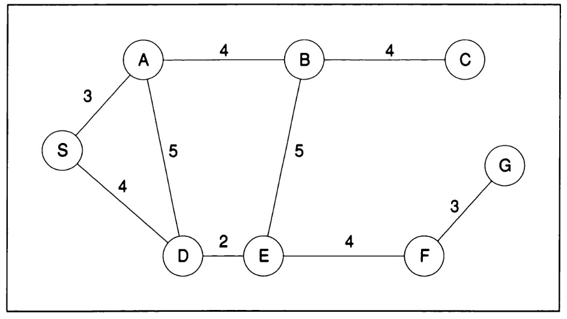

# Depth First Search and Breadth First Search in Python and Java

_Programación  del siguiente grafo utilizando Python y Java y los algoritmos BFS y DFS.
Donde S es el nodo inicio y G es el nodo final._

---
⌨️ con ❤️ por [JudithCristina](https://github.com/JudithCristina) 😊
